# ⚽ 足球头条 AI（Football News AI）产品需求文档（PRD）

> **版本**：v2.0　**状态**：评审通过　**日期**：2026-07-18
>
> **文档说明**：本文档是实现Football News AI项目的前置文档，项目的一切研发均遵循本文档进行开发。

---

## 目录

1. [文档信息](#一文档信息)
2. [项目背景](#二项目背景)
3. [产品定位](#三产品定位)
4. [目标用户与使用场景](#四目标用户与使用场景)
5. [产品目标与成功指标](#五产品目标与成功指标)
6. [产品范围](#六产品范围)
7. [功能架构](#七功能架构)
8. [功能需求详述](#八功能需求详述)
9. [非功能需求](#九非功能需求)
10. [技术架构](#十技术架构)
11. [里程碑计划](#十一里程碑计划)
12. [风险与限制](#十二风险与限制)
13. [验收标准](#十三验收标准)
14. [附录](#十四附录)

---

## 一、文档信息

| 项目名称 | 足球头条 AI（Football News AI） |
|---|---|
| 产品形态 | 移动端 H5 资讯 + AI 智能问答应用 |
| 文档负责人 | 钟昌成 |
| 文档版本 | v2.0 |
| 创建日期 | 2026-07-18 |
| 评审状态 | 评审通过 |

### 修订历史

| 版本 | 日期 | 修订人 | 说明 |
|------|------|--------|------|
| v1.0 | 2026-07-12 | 钟昌成 | 首次成稿，基于现有需求整理 |
| v2.0 | 2026-07-18 | 钟昌成 | 二次修订，完善具体细节和需求调整 |

---

## 二、项目背景

现有足球资讯阅读场景存在以下特点：

1. **资讯获取被动**：用户只能通过浏览列表被动获取新闻，无法针对"某场比赛结果""某队排名""球员数据"等具体问题快速获得答案。
2. **信息检索效率低**：新闻量大，传统关键词搜索难以覆盖语义相近的表达（如"上轮英超谁赢了"）。
3. **AI 回答不可信**：通用大模型缺乏足球实时数据与站内资讯支撑，易产生幻觉、回答过时。
4. **市场广阔**：当前主流足球资讯APP，如懂球帝，直播吧都缺少同类型的Agent问答助手

因此本项目在传统新闻资讯 App 的基础上，引入 **AI Agent + 多模态 RAG + 实时足球数据 + 用户记忆**，构建一款"**可查、可聊、可信**"的智能化足球资讯平台。

---

## 三、产品定位

> **一句话定位**：一款集 **实时足球资讯浏览、AI 智能问答、多模态知识检索与个性化记忆** 于一体的移动端足球信息服务平台。

**产品差异化亮点：**

- 🤖 **专业足球 AI 助手**：基于 LangGraph ReAct Agent，支持比赛结果 / 赛程 / 排名 / 球队 / 球员等专业问答，SSE 流式输出。
- 🧠 **多模态 RAG 检索**：文本 + 图片双模态语义检索，图文一体回答。
- 💾 三**层记忆体系**：工作记忆 / 短期上下文 / 长期用户偏好 ，回答越来越"懂你"。
- ✅ **回答可信度校验**：Agent 输出后进行事实验证（Verifier），降低 AI 幻觉。
- 🏟️ **实时足球数据**：今日赛程、实时比分、联赛积分榜、比赛中心一屏掌握。

---

## 四、目标用户与使用场景

### 4.1 目标用户

| 用户类型 | 特征描述 |
|---|---|
| 球迷/看球人群 | 关注联赛动态、赛程、比分、排名，希望快速获取赛事信息 |
| 足球内容消费者 | 阅读赛事战报、球队情报、球员动态等新闻内容 |
| 深度爱好者 | 会提问"XX vs XX 谁赢了""XX 队排名""XX 球员数据"，需要专业、实时、可信的回答 |

### 4.2 核心使用场景

| 场景编号 | 场景描述 |
|---|---|
| S1 | 打开 App 浏览首页资讯，按分类（英超/西甲/欧冠等）阅读新闻详情 |
| S2 | 查看今日赛程与实时比分、最近完赛 / 即将开始的比赛、五大联赛积分榜 |
| S3 | 向 AI 助手提问赛事问题（结果 / 赛程 / 排名 / 球队 / 球员），获得带数据来源的回答 |
| S4 | 问 AI "我收藏了什么 / 我最近看过什么"，获得基于个人数据的个性化回答 |
| S5 | 对 AI 回答进行 👍/👎 反馈，帮助系统持续优化 |
| S6 | 收藏感兴趣的文章，随时在"我的收藏"中回看；查看浏览历史 |
| S7 | 切换明暗主题、中英文语言，维护个人资料 |

---

## 五、产品目标与成功指标

### 5.1 产品目标

1. 提供流畅的移动端足球资讯浏览体验。
2. 让 AI 助手成为用户获取足球信息的**可信入口**（专业、实时、可溯源）。
3. 通过记忆与个性化，提升用户粘性与回答满意度。
4. 建立回答质量**反馈闭环**，持续优化 Prompt / RAG / 工具链。

### 5.2 成功指标（建议，待业务确认）

| 指标 | 说明 | 目标（建议） |
|---|---|---|
| AI 回答满意度 | 基于 👍/👎 反馈，满意度 = 好评数 / 总反馈数 | ≥ 80% |
| AI 回答采纳率 | 用户点赞 + 未差评的回答占比 | ≥ 85% |
| 资讯人均浏览时长 | 每日人均停留时长 | 待定 |
| 资讯点击率 | 列表 → 详情转化率 | 待定 |
| 注册转化率 | 访问 → 注册转化 | 待定 |
| AI 人均提问数 | 日活用户平均提问次数 | 待定 |
| 收藏/历史使用率 | 使用收藏或历史功能的用户占比 | 待定 |

---

## 六、产品范围

### 6.1 本期范围（已实现）

| 模块 | 说明 | 优先级 |
|---|---|---|
| 用户系统 | 注册 / 登录 / 资料 / 改密 | P0 |
| 新闻资讯 | 首页列表、分类、详情（Markdown）、收藏、历史 | P0 |
| AI 智能助手 | Agent 对话、SSE 流式、工具可视化、记忆、校验、反馈 | P0 |
| 实时足球数据 | 今日赛程、比分、比赛中心、联赛积分榜 | P1 |
| 个性化 | 明暗主题、多语言（中/英） | P1 |

### 6.2 后续规划（预留）

| 内容 | 说明 | 进展 |
|---|---|---|
| 多 Agent 编排 | 由 Supervisor 编排多个子 Agent（架构已预留） | 当前使用路由管理Agent |
| Agent 自动配图 | 回答中由 Agent 自动挑选配图 | 已实现（有联网搜素和API兜底） |
| 图片→文本检索 | 当前支持 text→text、text→image，image→text 预留 | 暂未设计 |
| 生产部署 | 域名、CDN、正式环境配置、HTTPS | 备案中 |

---

## 七、功能架构

```
足球头条 AI 产品
│
├── 📰 新闻资讯模块
│   ├── 首页资讯（分类 Tab + 下拉刷新 + 分页加载）
│   ├── 新闻详情（Markdown 富文本渲染 + 安全净化）
│   ├── 分类浏览
│   ├── 收藏管理（收藏 / 取消 / 列表 / 清空）
│   └── 浏览历史（记录 / 列表 / 删除 / 清空）
│
├── 🤖 AI 智能助手模块
│   ├── 会话对话（SSE 流式 + 一次性）
│   ├── 工具调用过程可视化
│   ├── 会话历史恢复（按用户隔离，localStorage 持久化）
│   ├── 四层记忆（工作 / 短期 / 长期 / 外部知识）
│   ├── 回答可信度校验（Verifier）
│   ├── 反馈闭环（👍/👎 + trace_id 溯源）
│   └── 多模型切换（DeepSeek / Qwen）
│
├── 🏟️ 实时足球数据模块
│   ├── 足球首页（今日赛程 + 实时比分 Widget）
│   ├── 比赛中心（最近完赛 / 即将开始）
│   ├── 联赛积分榜（五大联赛）
│   └── Widget 数据反向代理（保护 API Key）
│
├── 👤 用户模块
│   ├── 注册 / 登录
│   ├── 个人信息（昵称 / 头像 / 性别 / 简介 / 手机号）
│   └── 修改密码
│
└── ⚙️ 个性化设置模块
    ├── 明暗主题切换
    ├── 多语言（简体中文 / English）
    └── 偏好持久化
```

---

## 八、功能需求详述

> 各功能模块请分别粘贴实际界面截图。

---

### 8.1 用户系统

#### 8.1.1 功能描述

支持用户注册、登录、查看/编辑个人资料、修改密码。登录后收藏、历史、AI 会话与账号绑定并同步。

#### 8.1.2 功能点与业务规则

| 功能点 | 业务规则 |
|---|---|
| 注册 | 需填用户名 + 密码；成功后自动登录并返回 token 与用户信息 |
| 登录 | 校验用户名 + 密码；成功后返回 token，后续请求通过 `Authorization` 头携带 |
| 获取用户信息 | 返回昵称、头像、性别、简介、手机号等信息；默认头像与默认简介（"这个人很懒，什么都没留下"） |
| 更新资料 | 可更新昵称 / 头像 / 性别 / 简介 / 手机号 |
| 修改密码 | 需提供旧密码校验，再设置新密码 |

#### 8.1.3 页面清单

| 页面 | 路由 | 说明 |
|---|---|---|
| 登录页 | `/login` | 用户名 / 密码登录 |
| 注册页 | `/register` | 用户名 / 密码注册 |
| 我的页 | `/my` | 用户卡片（登录态 / 游客态）、快捷入口 |
| 个人信息页 | `/profile` | 查看 / 编辑个人资料 |

#### 8.1.4 界面截图

> **【界面截图：登录页】**
>
> 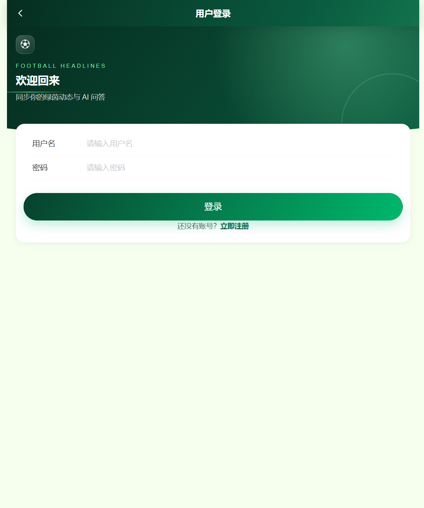
>

> **【界面截图：注册页】**
>
> 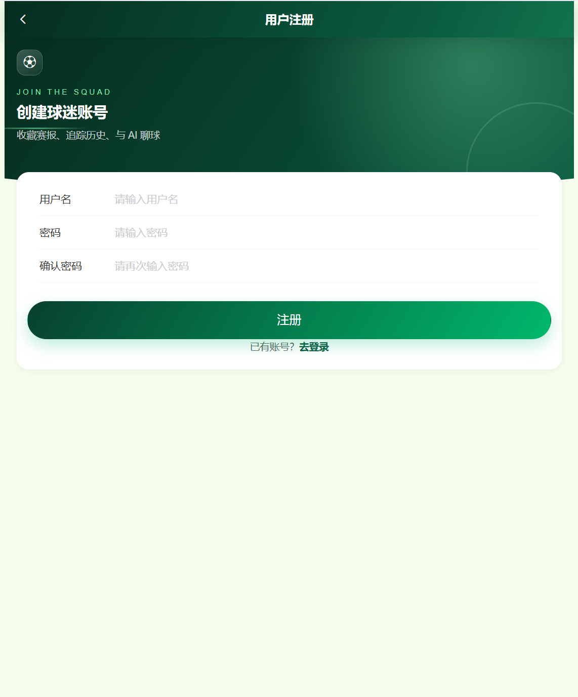
>

> **【界面截图：我的页 / 个人信息页】**
>
> 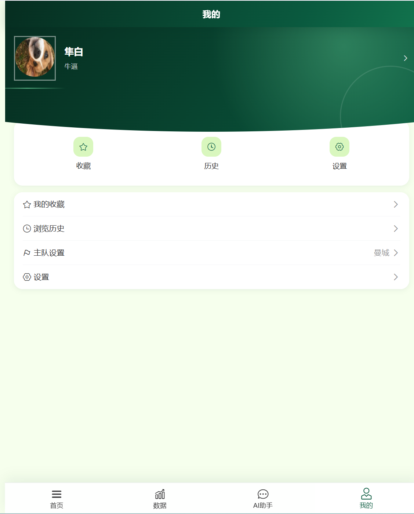
>
> 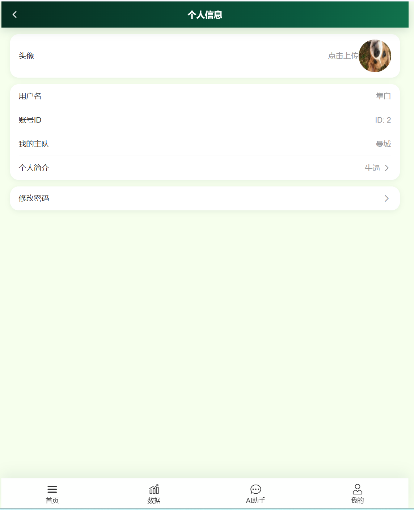

#### 8.1.5 验收标准

- [x] 注册成功后可正常登录，token 生效
- [x] 修改资料后接口返回更新后的信息，前端刷新可见
- [x] 未登录访问收藏 / 历史 / AI 等受保护功能有引导跳转登录

---

### 8.2 新闻资讯模块

#### 8.2.1 功能描述

提供足球资讯的浏览、分类阅读、详情阅读与 Markdown 富文本渲染，支持收藏与浏览历史。

#### 8.2.2 功能点与业务规则

| 功能点 | 业务规则 |
|---|---|
| 首页资讯列表 | 顶部分类 Tab（英超 / 西甲 / 欧冠等），点击切换分类；支持下拉刷新、上拉分页加载；空态展示"暂无赛事资讯" |
| 新闻详情 | 以 Markdown 渲染正文，使用 `marked + DOMPurify` 做安全净化；进入详情自动记录浏览历史、浏览量 +1 |
| 分类浏览 | 提供分类入口（首页右上角图标）进入分类页 |
| 收藏 | 详情页可收藏 / 取消收藏；收藏列表分页展示；可一键清空 |
| 浏览历史 | 自动记录已读文章，支持分页查看、单条删除、一键清空 |

#### 8.2.3 页面清单

| 页面 | 路由 | 说明 |
|---|---|---|
| 首页（资讯） | `/home` | Hero 区 + 分类 Tab + 新闻列表 |
| 新闻详情 | `/news/detail/:id` | Markdown 正文、收藏按钮、相关资讯 |
| 分类页 | `/category` | 全部分类浏览 |
| 我的收藏 | `/favorite` | 收藏列表、清空 |
| 浏览历史 | `/history` | 历史列表、删除、清空 |

#### 8.2.4 界面截图

> **【界面截图：首页资讯列表】**
>
> 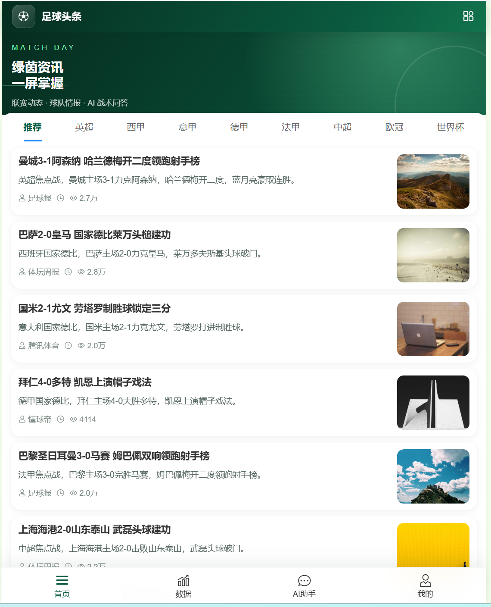
>

> **【界面截图：新闻详情页】**
>
> 
>

> **【界面截图：分类页】**
>
> 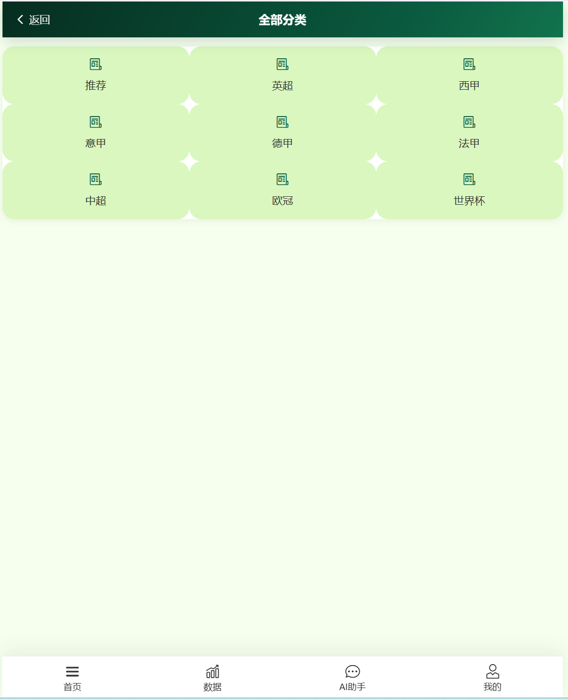
>

> **【界面截图：我的收藏 / 浏览历史页】**
>
> 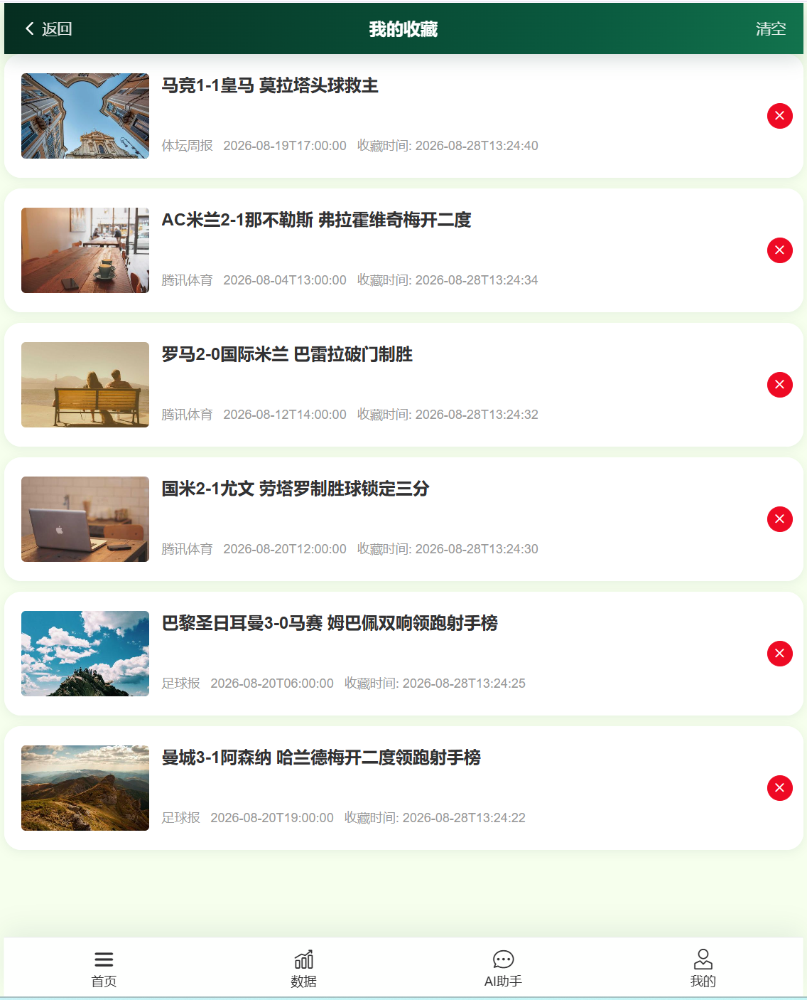
>
> 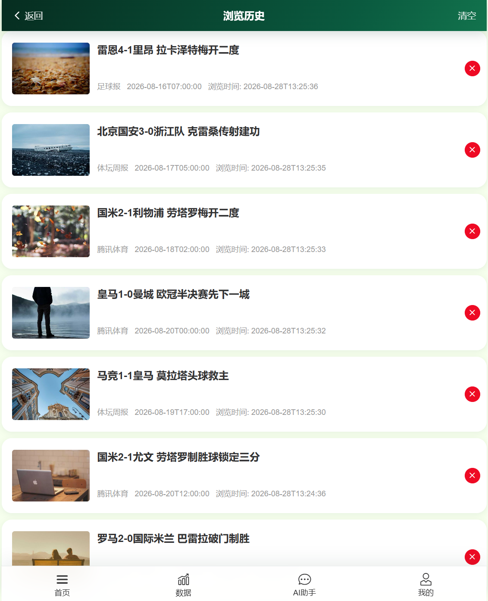

#### 8.2.5 验收标准

- [x] 分类切换、下拉刷新、分页加载正常，列表无重复、无空白
- [x] Markdown 正文渲染正常，无 XSS 风险（净化生效）
- [x] 收藏 / 取消收藏状态实时反馈，与后端同步
- [x] 浏览历史按时间倒序，删除与清空操作生效

---

### 8.3 AI 智能助手模块（核心亮点）

#### 8.3.1 功能描述

基于 **LangGraph ReAct Agent** 构建的足球智能问答助手。支持专业足球问答、站内新闻检索、用户个性化记忆、回答可信度校验与反馈闭环。

#### 8.3.2 功能点与业务规则

| 功能点 | 业务规则 |
|---|---|
| 对话模式 | 支持一次性返回（`POST /api/ai/chat`）与 **SSE 流式**（`POST /api/ai/chat/stream`）两种模式 |
| 流式事件 | 依次推送 `session` / `tool_call` / `token` / `tool_done` / `done` / `error` 事件，前端逐块渲染 |
| 工具过程可视化 | 回答前展示工具调用卡片（如"查询实时比赛数据""检索本站新闻库"），完成后打勾 |
| 会话恢复 | 会话 ID 按用户隔离存入 localStorage，刷新页面后恢复上下文 |
| 专业问答 | 支持比赛结果 / 赛程 / 排名 / 球队 / 球员等查询，套用回答模板（含队徽配图） |
| 站内检索 | 搜索新闻 / 读新闻详情 / 热门新闻 / 语义检索（RAG） |
| 个性化 | 可读用户收藏、浏览历史；通过 `remember` 工具记忆用户偏好（长期记忆） |
| 可信度校验 | Verifier 节点对回答做事实来源二次校验，识别幻觉并修正；前端展示"已校验 / 已修正"标记 |
| 反馈闭环 | 回答后可 👍/👎 评价（可附原因），关联 trace_id 可回溯完整日志链路 |
| 多模型 | `LLM_PROVIDER` 在 DeepSeek / Qwen 间切换，支持 max_tokens / 思考开关配置 |

#### 8.3.3 工具能力清单（Agent Tools）

| 分类 | 工具 | 作用 | 数据源 |
|---|---|---|---|
| news | `search_news` / `get_news_detail` / `get_hot_news` / `retrieve_news_tool` | 新闻搜索 / 详情 / 热门 / 语义检索 | MySQL / Qdrant |
| user | `get_my_favorites` / `get_my_history` / `remember` | 收藏 / 历史 / 长期记忆 | MySQL |
| image | `get_match_pick` / `retrieve_images_tool` | 球队 / 球员图片 / 本站图片检索 | thesportsDB / Qdrant |
| football | `get_match_result` | 比赛结果 / 赛程 / 排名 / 球队 / 球员（intent 路由 + 赛季回退） | api-football |
| web | `web_search` | 新闻 / 实时信息联网兜底 | Tavily |

#### 8.3.4 四层记忆体系

| 记忆层 | 载体 | 说明 |
|---|---|---|
| 工作记忆 | `AgentState`（messages + agent_trace） | 单轮 ReAct 状态 |
| 短期记忆 | `session_memory` 表（summary + key_facts + recent） | token 预算驱动，超预算自动折叠压缩 |
| 长期记忆 | `user_memory` 表 + `remember` 工具 | 记忆筛选：持久 / 个性化 / 重要 / 去重冲突 |
| 外部知识 | RAG + 足球 API + 联网 | 按需检索，与 Memory 边界明确 |

#### 8.3.5 回答流程

```
用户提问
  → 组装上下文（短期/长期记忆 + 当前日期）
  → LangGraph ReAct：LLM 决策 → 调用工具 → 收集证据 → 生成回答
  → Verifier 校验节点：事实来源二次校验，识别幻觉并修正
  → 流式推送：工具过程卡片 + 逐 token 回答
  → 用户 👍/👎 反馈（关联 trace_id 落库）
```

#### 8.3.6 界面截图

> **【界面截图：AI 问答首页（欢迎语 + 输入区）】**
>
> *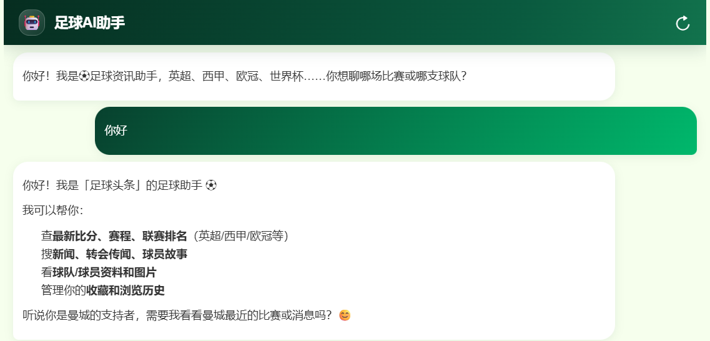*
>

> **【界面截图：AI 对话（工具调用过程卡片 + 流式回答）】**
>
> 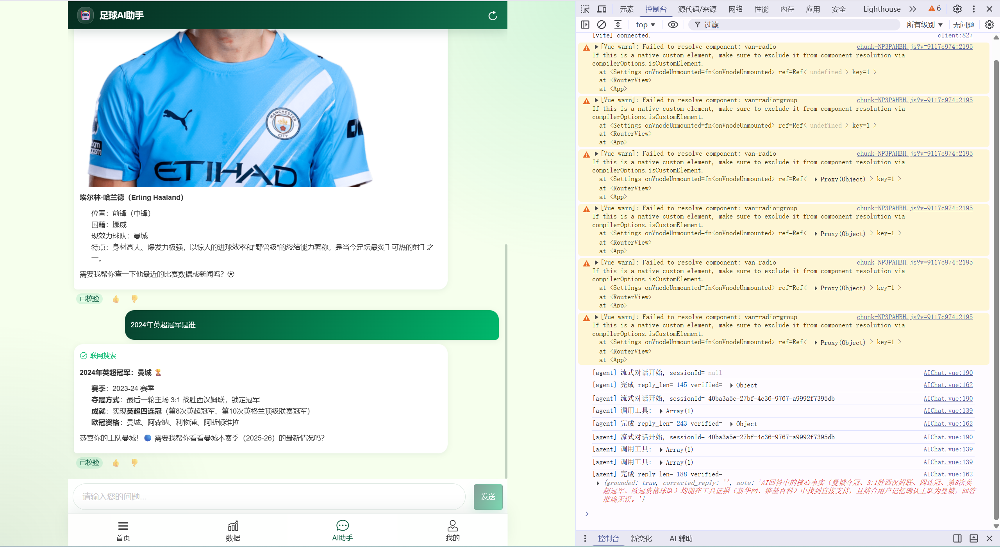

> **【界面截图：AI 对话（Verifier 校验标记 + 反馈按钮）】**
>
> *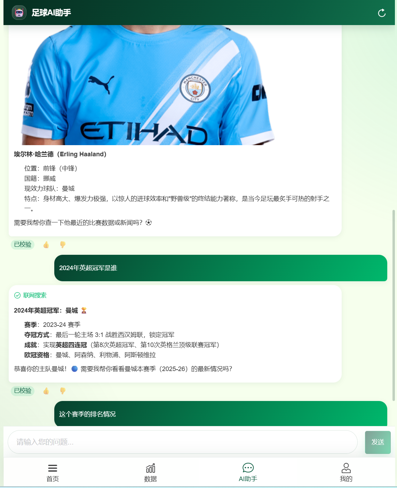*
>

#### 8.3.7 验收标准

- [x] SSE 流式输出流畅，工具调用卡片按顺序显示并标记完成
- [x] 专业问答（结果 / 排名 / 球员等）返回正确数据，配图使用库内真实图片
- [x] 刷新页面后可恢复历史对话
- [x] Verifier 能识别明显幻觉并给出修正回复，前端展示校验标记
- [x] 👍/👎 反馈提交成功，可关联 trace_id
- [x] 工具调用计数上限 + 反循环规则生效，超限时友好降级提示

---

### 8.4 实时足球数据模块

#### 8.4.1 功能描述

通过 **API-Football 官方 Widget + 后端反向代理** 提供实时赛事数据：今日赛程、实时比分、最近完赛 / 即将开始、五大联赛积分榜。

#### 8.4.2 功能点与业务规则

| 功能点 | 业务规则 |
|---|---|
| 足球首页 | 展示**今日赛程与实时比分**（`api-games` Widget，`date=today` + `live=all`） |
| 比赛中心 | 两个 Tab：**最近比赛**（`last=10` 最近完赛）、**即将开始**（`next=10`） |
| 联赛积分榜 | 五大联赛切换（英超 / 西甲 / 意甲 / 德甲 / 法甲），展示实时排名 |
| 数据安全 | Widget 数据经后端 `widget_proxy` 反向代理，**API Key 只保留在后端**，前端不接触 Key |

#### 8.4.3 代理接口

| 接口 | 说明 |
|---|---|
| `GET /widget-api/football/fixtures|standings|leagues|teams|players` | 只读反向代理，白名单限定数据端点，注入 `x-apisports-key`，带 30s 缓存 |

#### 8.4.4 页面清单

| 页面 | 路由 | 说明 |
|---|---|---|
| 足球首页 | `/football` | 今日赛程 + 实时比分 |
| 比赛中心 | `/match-center` | 最近完赛 / 即将开始 |
| 联赛积分榜 | `/league` | 五大联赛实时排名 |

#### 8.4.5 界面截图

> **【界面截图：足球首页（今日赛程 + 实时比分）】**
>
> *（请在此处粘贴足球首页实际截图）*
>

> **【界面截图：比赛中心（最近比赛 / 即将开始）】**
>
> *（请在此处粘贴比赛中心实际截图）*
>

> **【界面截图：联赛积分榜（五大联赛）】**
>
> *（请在此处粘贴联赛积分榜实际截图）*
>

#### 8.4.6 验收标准

- [ ] 今日赛程 / 实时比分、最近完赛 / 即将开始数据正确展示
- [ ] 五大联赛可切换，排名数据正确
- [ ] 前端页面无 API Key 泄露；未配置 Key 时返回友好提示（503 错误体）

---

### 8.5 收藏与浏览历史模块

#### 8.5.1 功能描述

提供新闻收藏与浏览历史管理，登录后与后端同步，支持分页、删除、清空。

#### 8.5.2 功能点与业务规则

| 功能点 | 业务规则 |
|---|---|
| 收藏检查 | 详情页进入时查询是否已收藏 |
| 收藏 / 取消 | 收藏与取消收藏实时反馈，重复操作幂等 |
| 收藏列表 | 分页展示（默认 10 条 / 页，最大 100），含文章信息与收藏时间 |
| 清空收藏 | 一键清空，提示确认 |
| 历史记录 | 浏览详情自动写入，按时间倒序 |
| 历史管理 | 分页查看、单条删除、一键清空 |

#### 8.5.3 界面截图

> **【界面截图：收藏列表页】**
>
> 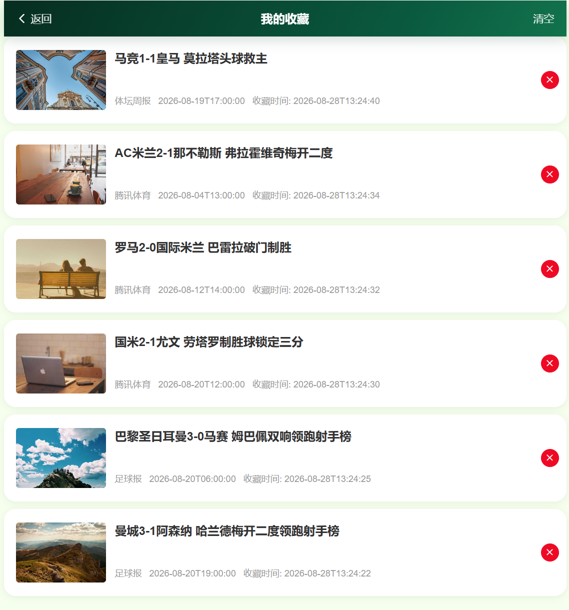
>

> **【界面截图：浏览历史页】**
>
> 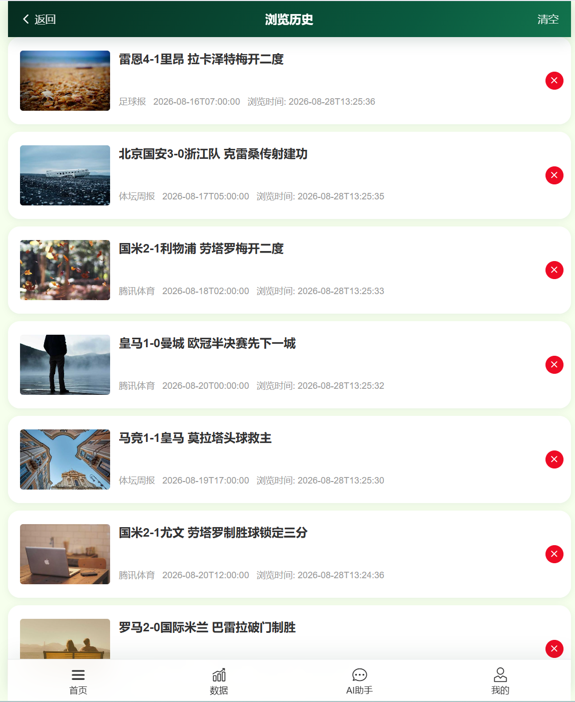
>

#### 8.5.4 验收标准

- [x] 收藏状态与后端一致，跨端同步
- [x] 分页 / 清空 / 删除均正确，无越权访问他人数据

---

### 8.6 个性化与设置模块

#### 8.6.1 功能描述

提供明暗主题切换、中英文多语言切换，偏好本地持久化。

#### 8.6.2 功能点与业务规则

| 功能点 | 业务规则 |
|---|---|
| 明暗主题 | 全局主题切换，选择后持久化 |
| 多语言 | 简体中文 / English（vue-i18n），切换后持久化，页面文案即时生效 |
| 设置页 | 提供主题、语言等入口 |

#### 8.6.3 界面截图

> **【界面截图：设置页（主题 / 语言切换）】**
>
> 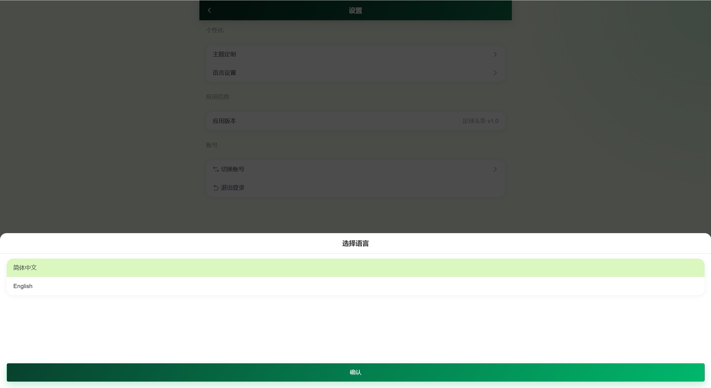
>
> 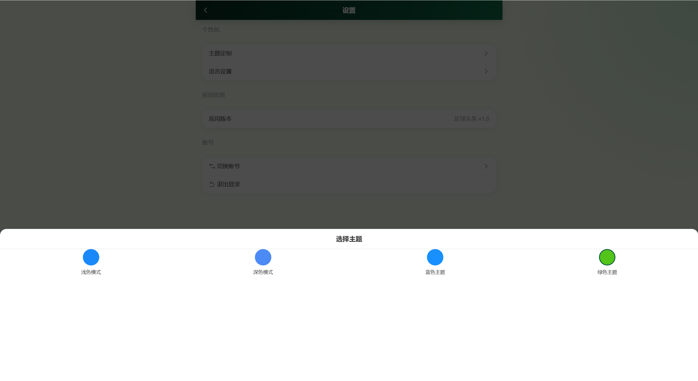

#### 8.6.4 验收标准

- [x] 主题 / 语言切换即时生效并持久化，重启不丢失

---

### 8.7 页面信息架构与导航

底部 TabBar 四个一级入口：**首页（资讯） / 数据（足球） / AI 助手 / 我的**。

| Tab | 路由 | 图标 |
|---|---|---|
| 首页 | `/home` | wap-nav |
| 数据 | `/football` | chart-trending-o |
| AI 助手 | `/aichat` | chat-o |
| 我的 | `/my` | user-o |

> **【界面截图：底部 TabBar 导航】**
>
> 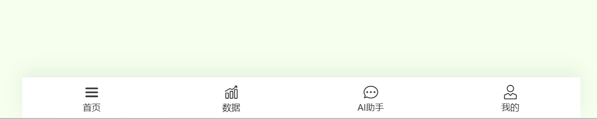
>

---

## 九、非功能需求

### 9.1 性能需求

| 指标 | 要求（建议） |
|---|---|
| 资讯列表首屏加载 | ≤ 2s（正常网络） |
| AI 首个 token 返回 | ≤ 3s（正常网络、LLM 服务可用） |
| 新闻详情渲染 | ≤ 1.5s |
| 分页加载 | 滑动流畅，无卡顿 |

### 9.2 安全需求

- 前端不暴露任何 API Key（LLM / 足球数据 / 联网搜索 Key 全部后端管理）。
- Widget 反向代理过滤客户端传入的伪造 Key 头，仅白名单路径可访问。
- 新闻正文经 DOMPurify 净化，防止 XSS。
- 密码加密存储，接口统一鉴权（`Authorization: token`）。
- 请求日志记录方法 / 路径 / 状态码 / 耗时，异常落日志。

### 9.3 可用性 / 兼容性

- 移动端优先，基于 Vant 4 组件库，适配主流移动端浏览器。
- 后端要求 Python ≥ 3.10、MySQL、Redis、Docker（Qdrant + 嵌入服务）。
- Redis 缓存不可用时自动降级，不影响核心功能。

### 9.4 可观测性

- OpenTelemetry 全链路追踪：HTTP → Agent → LLM → RAG → Tool 均挂同一 trace_id。
- JSON 结构化日志（按天滚动文件）+ 控制台彩色日志。
- 回答反馈关联 trace_id，可回溯完整日志链路。

---

## 十、技术架构

```
                用户
                 |
            Vue3 移动端（Vant 4）
                 |
           FastAPI 后端（SSE / REST）
                 |
   ┌─────────────┼─────────────┐
   │             │             │
 AI Agent     RAG 检索     数据服务
(LangGraph)  (Qdrant 多模态)  (Football API)
   │             │             │
   │       bge / Chinese-CLIP   │
   │       (Docker 嵌入服务)     │
   │             │             │
   └────── LLM（DeepSeek / Qwen）┘
```

### 10.1 前端技术栈

| 分类 | 技术 |
|---|---|
| 框架 | Vue 3 |
| 构建 | Vite |
| 路由 | Vue Router 4 |
| 状态 | Pinia（持久化：pinia-plugin-persistedstate） |
| UI | Vant 4 |
| 网络 | Axios |
| 国际化 | vue-i18n |
| 富文本 | marked + DOMPurify |

### 10.2 后端技术栈

| 分类 | 技术 |
|---|---|
| Web | FastAPI + uvicorn（异步、SSE） |
| AI Agent | LangGraph ReAct（单 Agent，预留多 Agent 扩展） |
| LLM | DeepSeek / Qwen（OpenAI 兼容，模型工厂可切换） |
| 向量库 | Qdrant（命名向量：text=bge / image=Chinese-CLIP） |
| Embedding | bge-small-zh-v1.5（文本）/ Chinese-CLIP（图片），Docker 部署 |
| 数据库 | MySQL + Redis（缓存不可用自动降级） |
| 实时数据 | api-football + thesportsDB |
| 可观测 | OpenTelemetry + python-json-logger |

### 10.3 核心目录结构

```
FootballAgent/
├── soccernews_backend/          # FastAPI 后端
│   ├── agents/                  # Agent 核心（图 / 记忆 / RAG / Verifier / 工具）
│   ├── routers/                 # 路由（users/news/favorite/history/ai_chat/widget_proxy）
│   ├── crud/ · models/ · schemas/ · utils/ · config/
│   └── sql/                     # 建库建表脚本
├── soccernews_frontend/         # Vue3 前端（views/components/store/i18n）
├── docker-compose.yml           # Qdrant + 文本/图片嵌入服务
└── README.md
```

---

## 十一、里程碑计划

> 项目主体已实现，以下为当前状态与后续规划建议。

| 阶段 | 内容 | 状态 |
|---|---|---|
| M0 基础建设 | 前后端骨架、用户系统、新闻资讯、收藏历史 | ✅ 已完成 |
| M1 Agent 升级 | LangGraph ReAct + 多模态 RAG + Docker 化 + SSE 流式 | ✅ 已完成 |
| M2 Agent 增强 | 四层记忆、足球专业能力（api-football）、反馈闭环、Verifier、可观测 | ✅ 已完成 |
| M3 打磨优化 | 前端 UI 优化（当前分支） | ✅ 已完成 |
| M4 上线准备 | 生产配置、HTTPS、CDN、数据脱敏、压测 | ⏳ 规划中 |
| M5 演进方向 | 多 Agent 编排、Agent 自动配图、图片→文本检索、多端（小程序 / App） | ⏳ 规划中 |

---

## 十二、风险与限制

| 编号 | 风险 / 限制 | 影响 | 应对措施 |
|---|---|---|---|
| R1 | api-football 免费套餐仅覆盖 2022–2024 赛季 | 最新赛季数据缺失 | 升级付费套餐；`.env` 调整 `API_FOOTBALL_SEASON` |
| R2 | 外部 API（LLM / 足球 / 联网）不可用 | AI 与数据功能受影响 | 超时控制、友好降级提示；Redis 缓存降低请求消耗 |
| R3 | LLM 幻觉 | 回答不准确 | Verifier 校验节点 + 工具证据 + 回答模板 + 反馈闭环 |
| R4 | 多模态检索依赖 Docker 嵌入服务 | 服务未启动则 RAG 不可用 | 启动自动建索引失败时仅告警；支持手动 `reindex` |
| R5 | 免费套餐请求配额有限 | Widget / 工具请求受限 | 代理带 30s 缓存；控制检索频率 |
| R6 | 单一 LLM 成本 / 质量波动 | 回答质量不稳定 | 多模型可切换（DeepSeek / Qwen）；`QWEN_ENABLE_THINKING` 控 token |

---

## 十三、验收标准

### 13.1 功能验收

- [x] 八大模块（用户 / 资讯 / AI / 实时数据 / 收藏 / 历史 / 个性化 / 设置）功能点全部符合本文档描述
- [x] AI 专业问答、RAG 检索、记忆、Verifier、反馈闭环端到端跑通
- [x] 收藏、历史、AI 会话登录后与后端正确同步

### 13.2 体验验收

- [x] 移动端在主流浏览器下正常显示，底部导航与各页面交互流畅
- [x] 明暗主题、中英文切换即时生效
- [x] 页面加载、流式输出无明显卡顿

### 13.3 技术验收

- [x] 前后端分离，接口统一返回 `{code, message, data}` 结构
- [x] API Key 无前端泄露；新闻渲染无 XSS；鉴权覆盖受保护接口
- [x] 全链路 trace_id 贯通，日志可检索、可回溯
- [x] Docker 一键启动 Qdrant + 双模态嵌入服务；数据库脚本可重复初始化

---

## 十四、附录

### 14.1 相关文档链接

| 文档 | 路径 |
|---|---|
| 项目总 README | `FootballAgent/README.md` |
| 后端 README | `soccernews_backend/README.md` |
| 前端 README | `soccernews_frontend/README.md` |
| API 接口规范文档 | `soccernews_backend/API接口规范文档.md` |
| 后端设计说明文档 | `soccernews_backend/项目后端设计说明文档.md` |
| AI 对话模块 Agent 化设计方案 | `soccernews_backend/AI对话模块Agent化设计方案.md` |

### 14.2 主要接口一览

| 接口 | 方法 | 说明 | 需登录 |
|---|---|---|---|
| `/api/user/register` `/login` `/info` `/update` `/password` | POST/POST/GET/PUT/PUT | 用户模块 | 部分 |
| `/api/news/categories` `/list` `/detail` | GET | 新闻模块 | — |
| `/api/favorite/check` `/add` `/remove` `/list` `/clear` | 组合 | 收藏模块 | ✅ |
| `/api/history/add` `/list` `/delete/{id}` `/clear` | 组合 | 浏览历史 | ✅ |
| `/api/ai/chat` | POST | AI Agent 对话（一次性） | ✅ |
| `/api/ai/chat/stream` | POST | AI Agent 对话（SSE 流式 + 工具过程） | ✅ |
| `/api/ai/history` | GET | 会话历史（刷新恢复） | ✅ |
| `/api/ai/rag/reindex` | POST | 重建 RAG 索引 | ✅ |
| `/api/ai/feedback` | POST | 回答反馈（👍/👎） | ✅ |
| `/widget-api/football/*` | GET | 足球 Widget 只读代理 | — |
